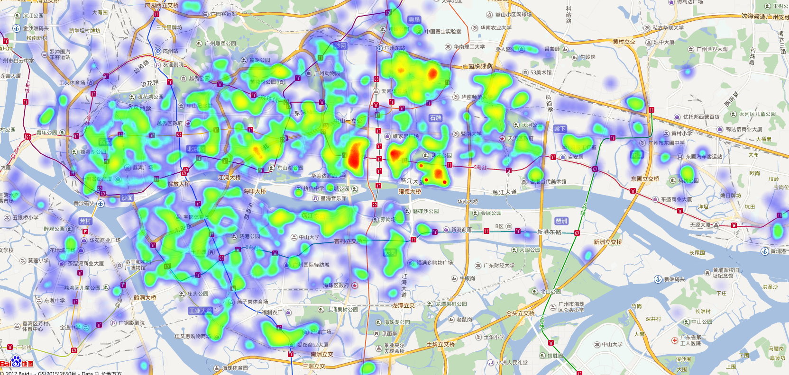
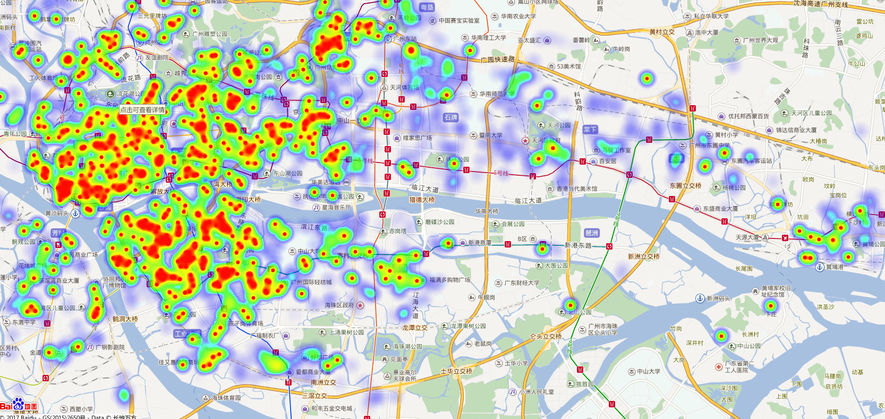

# gzEstate #
抓取广州房价，并做一些简单的分析，但是目前还只完成了房价热图生成。
当然，简单的修改配置文件后用来分析其他城市房价也是可以的。
### What is this repository for? ###

* Quick summary: 
 搭好依赖环境后，运行python3 main.py，最终将在指定目录生成html文件，
 使用浏览器打开该html文件即可得到房价热图：
 
 以及楼龄热图：
 
* Version: 算alpha版吧

### 怎样运行? ###

* 快速安装: 
推荐使用[anaconda](https://www.continuum.io/downloads)运行gzEstate，请选择其中的python3版本

* 配置: 按需求修改config.py中的配置。如果用户没有百度开发者秘钥，
可以把最终生成的html文件复制到[这里](http://developer.baidu.com/map/jsdemo.htm#c2_4)的代码编辑区，点击运行后就可以看到所生成的热图。
如果用户有百度开发者秘钥，可以在工程目录新建一个baidu_api_ak.py，并在其中定义变量ak="您的秘钥"，
这样，生成的html文件就可以直接用浏览器打开看到热图了。
* 依赖:
      [requests](https://pypi.python.org/pypi/requests), 
      [beautifulsoup4](https://pypi.python.org/pypi/beautifulsoup4), 
      [pandas](https://pypi.python.org/pypi/pandas),
      [numpy](https://pypi.python.org/pypi/numpy)
